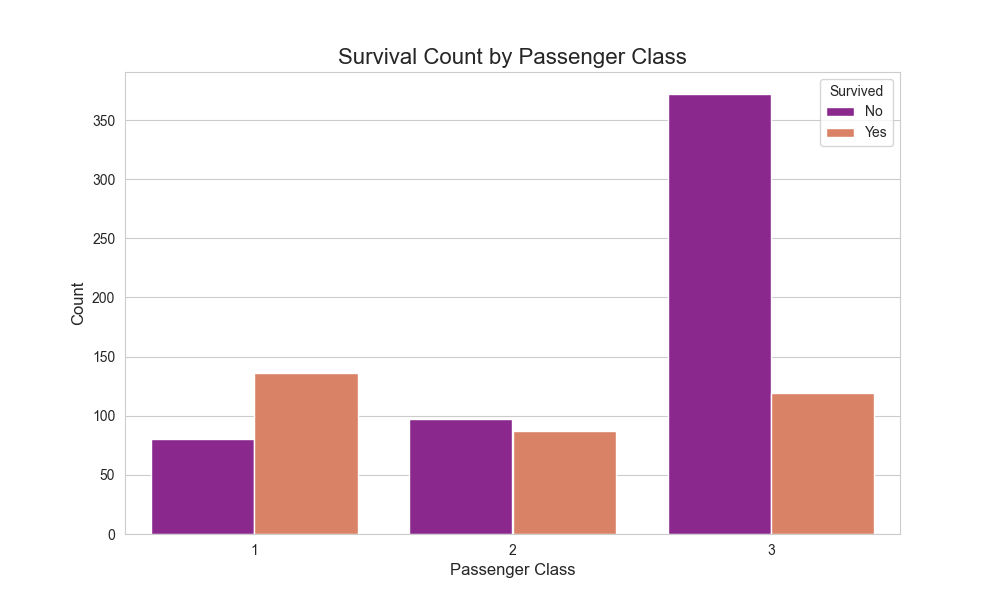

# 🚢 Project 1: Titanic Survival Analysis (EDA)

## 🎯 Objective
To perform an in-depth Exploratory Data Analysis (EDA) on the classic Titanic dataset. The analysis aims to uncover key factors that influenced passenger survival and to tell a story using data visualization.

## 📖 Topic Introduction
**What is Exploratory Data Analysis (EDA)?**
EDA is the crucial process of performing initial investigations on data to discover patterns, spot anomalies, test hypotheses, and check assumptions with the help of summary statistics and graphical representations. It's about getting to know your data before you start formal modeling. The main goal is to see what the data can tell us beyond the formal modeling or hypothesis testing task.

## 📊 Dataset
- **Source:** [Kaggle's Titanic - Machine Learning from Disaster](https://www.kaggle.com/c/titanic)
- **Description:** Contains passenger information (age, gender, class, etc.) and whether they survived the sinking of the Titanic.

## 🛠️ Tech Stack
- Python, Pandas, NumPy, Matplotlib, Seaborn

## 📈 Workflow
1.  **Data Loading & Cleaning:** Loaded the `train.csv` file, handled missing values.
2.  **Exploratory Data Analysis (EDA):** Investigated relationships between survival and key features.
3.  **Visualization:** Created count plots, histograms, and a correlation heatmap to visualize findings.

## ✨ Key Results
- **Gender:** Women had a significantly higher survival rate (~74%) than men (~19%).
- **Passenger Class:** 1st class passengers had the highest survival rate (~63%).

## 🚀 How to Run
1. Clone the repository.
2. Install required libraries: `pip install pandas matplotlib seaborn`
3. Run the Jupyter Notebook or Python script `titanic_eda.py`.

## 📚 Resources
- **Video:** [StatQuest: Exploratory Data Analysis (EDA), A Crash Course](https://www.youtube.com/watch?v=HddgL9ONvXo)
- **Article:** [A Gentle Introduction to Exploratory Data Analysis](https://towardsdatascience.com/a-gentle-introduction-to-exploratory-data-analysis-f11743615964)
