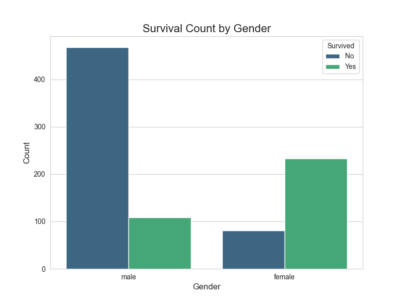
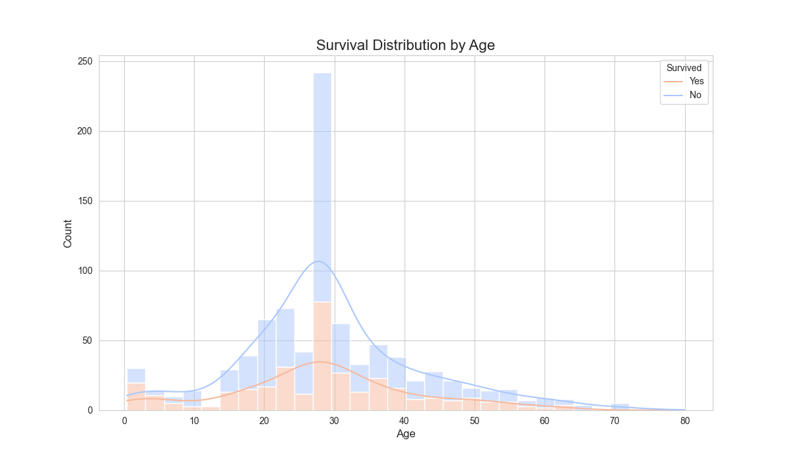
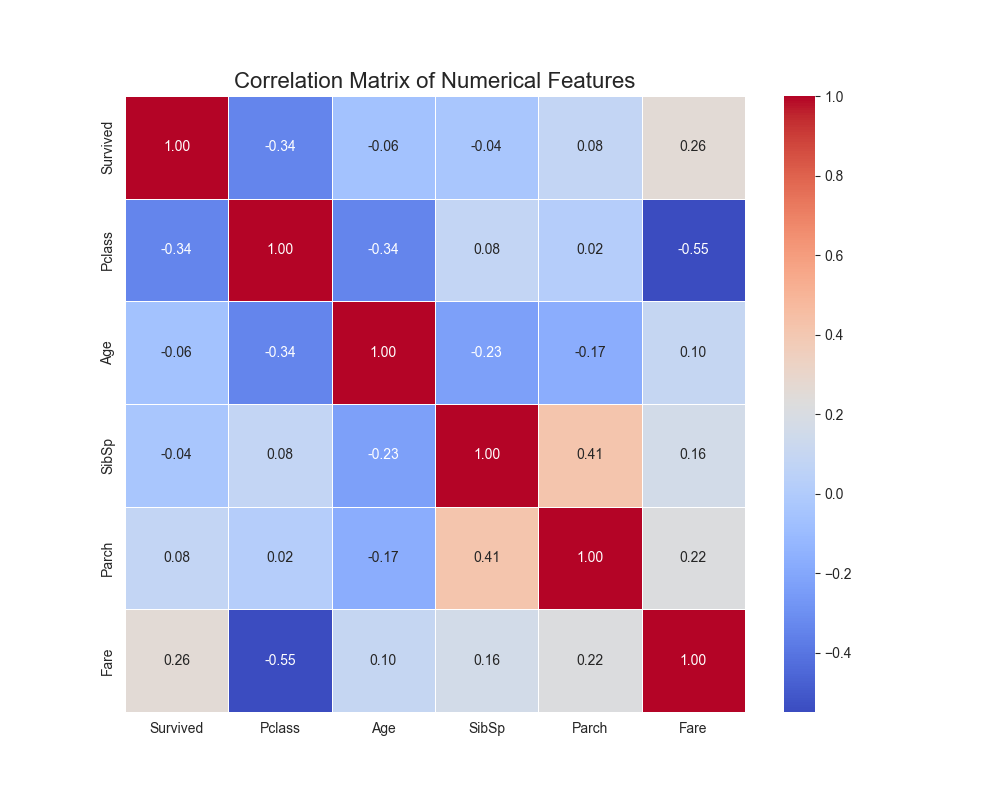
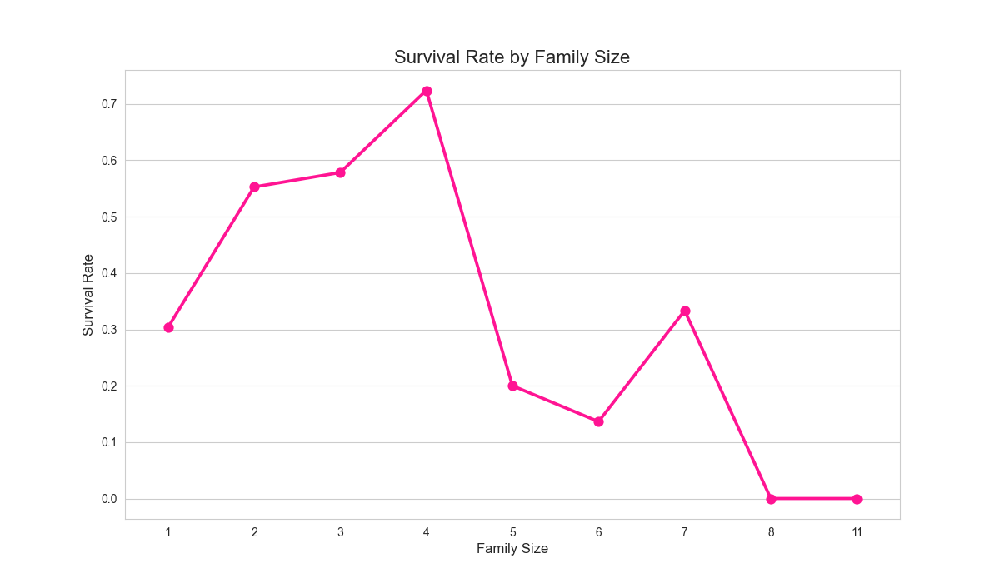
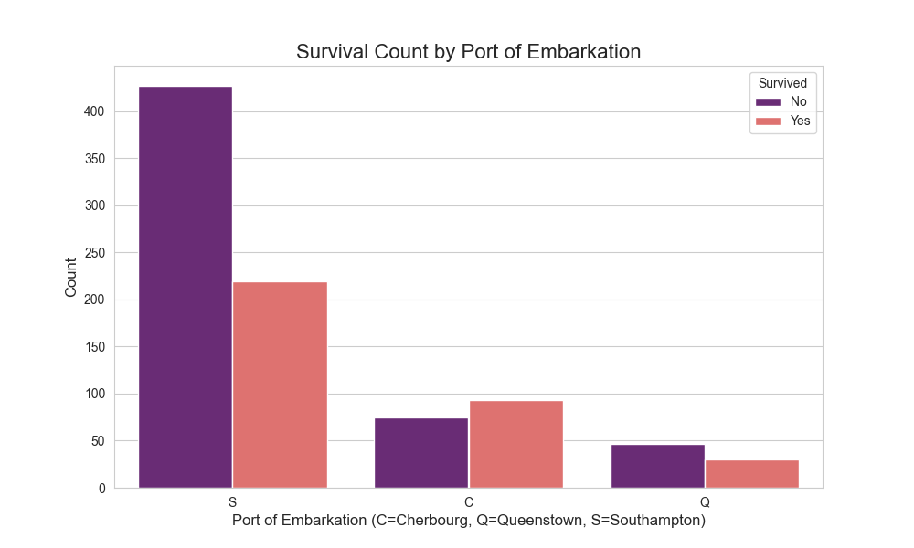

# 🚢 Project 1: Titanic Survival Analysis (EDA)

## 📖 Topic Introduction
**What is Exploratory Data Analysis (EDA)?**
EDA is the crucial process of performing initial investigations on data to discover patterns, spot anomalies, test hypotheses, and check assumptions with the help of summary statistics and graphical representations. It's about getting to know your data before you start formal modeling. The main goal is to see what the data can tell us beyond the formal modeling or hypothesis testing task.

## 🎯 Objective
The goal of this project is to perform an in-depth Exploratory Data Analysis (EDA) on the classic Titanic dataset. The analysis aims to uncover key factors that influenced passenger survival and to tell a story using data visualization.

## 📊 Dataset
- **Source:** [Kagle's Titanic - Machine Learning from Disaster](https://www.kaggle.com/c/titanic)
- **Description:** The dataset contains passenger information (age, gender, class, etc.) and whether they survived the sinking of the Titanic.

## 🛠️ Tech Stack
- Python
- Pandas
- NumPy
- Matplotlib
- Seaborn

## 📈 Workflow
1.  **Data Loading & Cleaning:** Loaded the `train.csv` file, handled missing values in `Age` and `Embarked` columns.
2.  **Exploratory Data Analysis (EDA):** Investigated the relationships between survival and key features like gender, passenger class, age, family size, and fare.
3.  **Visualization:** Created several plots, including count plots, histograms, and a correlation heatmap to visualize the findings.

## ✨ Key Results & Visuals
The analysis revealed several key insights and relationships within the data. Below is a gallery of the visualizations created:

| Survival by Passenger Class | Survival by Gender |
| :---: | :---: |
|  |  |
| --- | --- |
| **Insight:** 1st class passengers had a significantly higher chance of survival than those in 3rd class. | **Insight:** Women had a much higher survival rate (~74%) than men (~19%). |

| Survival Distribution by Age | Correlation of Features |
| :---: | :---: |
|  |  |
| --- | --- |
| **Insight:** A higher proportion of children (ages 0-10) survived compared to other age groups. | **Insight:** `Fare` and `Pclass` show the strongest correlations with `Survived`. |

| Survival Rate by Family Size | Survival by Port of Embarkation |
| :---: | :---: |
|  |  |
| --- | --- |
| **Insight:** Traveling alone lowered survival chances, but very large families also had a lower survival rate. | **Insight:** Passengers who embarked at Cherbourg ('C') had a notably higher survival rate. |

## 📚 Resources
- **Video:** [StatQuest: Exploratory Data Analysis (EDA), A Crash Course](https://www.youtube.com/watch?v=HddgL9ONvXo)
- **Article:** [A Gentle Introduction to Exploratory Data Analysis](https://towardsdatascience.com/a-gentle-introduction-to-exploratory-data-analysis-f11743615964)
