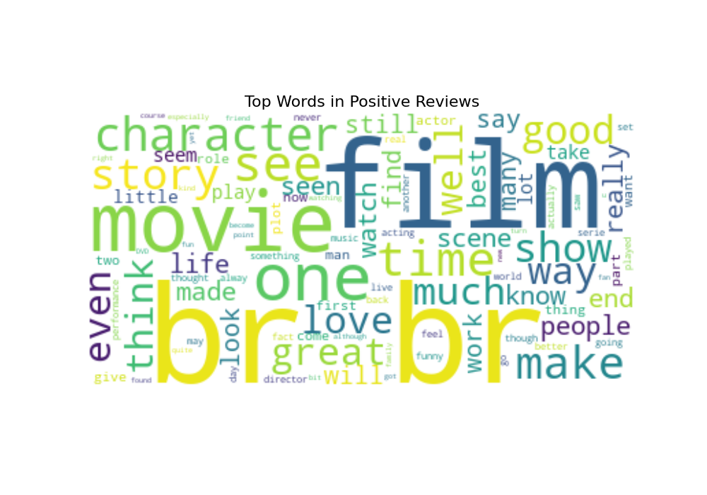

# 🎬 Project 10: IMDb Movie Review Sentiment Analysis

## 🎯 Objective
To introduce Natural Language Processing (NLP) by building a sentiment analysis classifier to determine whether a movie review is positive or negative.

## 📖 Topic Introduction
**What is Natural Language Processing (NLP) and Sentiment Analysis?**
- **NLP:** A field of artificial intelligence that enables computers to understand, interpret, and process human language.
- **Sentiment Analysis:** A common NLP task that involves identifying and categorizing opinions expressed in a piece of text. The core challenge is **vectorization**—turning text into numbers that a model can understand.

## 📊 Dataset
- **Source:** [IMDb Dataset of 50K Movie Reviews on Kaggle](https://www.kaggle.com/datasets/lakshmi25npathi/imdb-dataset-of-50k-movie-reviews)
- **Note:** Due to its large size, the dataset file is not included in this repository. Please download it directly from the Kaggle link above.

## 🛠️ Tech Stack
- Python, Pandas, Scikit-learn, Matplotlib, WordCloud

## 📈 Workflow
1.  **EDA:** Generated Word Clouds to visualize frequent words in positive and negative reviews.
2.  **Pipeline Creation:** Built a Scikit-learn `Pipeline` to chain text vectorization (`CountVectorizer`) and classification (`LogisticRegression`).
3.  **Model Training & Evaluation:** Trained the pipeline and assessed its performance.

## ✨ Key Results
- **Accuracy:** Achieved **~90% accuracy** on the test set.
- **Key Words:** Word clouds clearly showed the distinction between positive ("great", "best") and negative ("bad", "waste") vocabulary.

## 🚀 How to Run
1.  Clone the repository.
2.  Download the dataset from the Kaggle link above and place it in the project folder.
3.  Install required libraries: `pip install pandas scikit-learn matplotlib wordcloud`
4.  Run the Jupyter Notebook or Python script.

## 📚 Resources
- **Video:** [Krish Naik: NLP Tutorial Series](https://www.youtube.com/playlist?list=PLZoTAELRMXVMdJ5a9gVhku3l2w6H6-6k6)
- **Documentation:** [Scikit-learn: Working With Text Data](https://scikit-learn.org/stable/tutorial/text_analytics/working_with_text_data.html)
