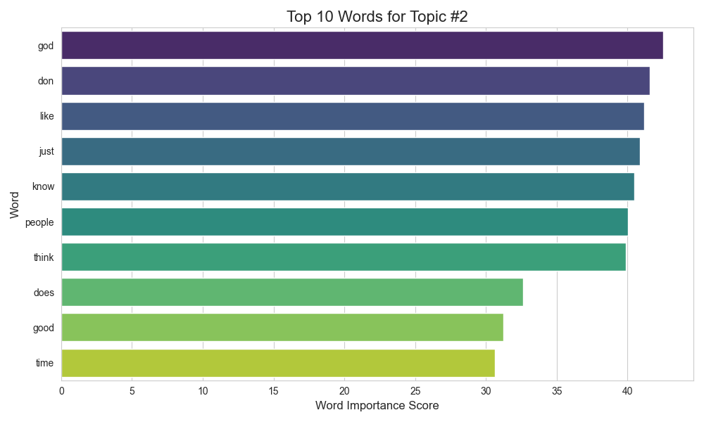

# 📰 Project 11: Discovering Topics in News Articles

## 🎯 Objective
To use an unsupervised NLP technique, Latent Dirichlet Allocation (LDA), to automatically discover the hidden thematic topics within a large collection of newsgroup posts.

## 📊 Dataset
- **Source:** Built-in Scikit-learn `fetch_20newsgroups` dataset.
- **Description:** A collection of ~18,000 newsgroup posts on 20 different topics. A subset of 5 topics was used for this analysis.

## 🛠️ Tech Stack
- Python
- Scikit-learn (TfidfVectorizer, LatentDirichletAllocation)
- Matplotlib
- Seaborn

## 📈 Workflow
1.  **Data Loading:** Loaded a subset of the 20 Newsgroups dataset.
2.  **Text Vectorization:** Converted the text documents into a matrix of TF-IDF features, which gives more weight to important and topic-specific words.
3.  **Topic Modeling:** Applied LDA to the TF-IDF matrix to discover 5 distinct topics.
4.  **Interpretation:** Analyzed the top words for each discovered topic to assign a human-readable theme.

## ✨ Key Results & Visuals
The LDA model successfully identified coherent and distinct topics from the unlabeled text data.
- **Discovered Topics:** The model automatically grouped words to form themes like "Space Exploration," "Computer Graphics," "Baseball," "Christianity," and "Gun Politics."

