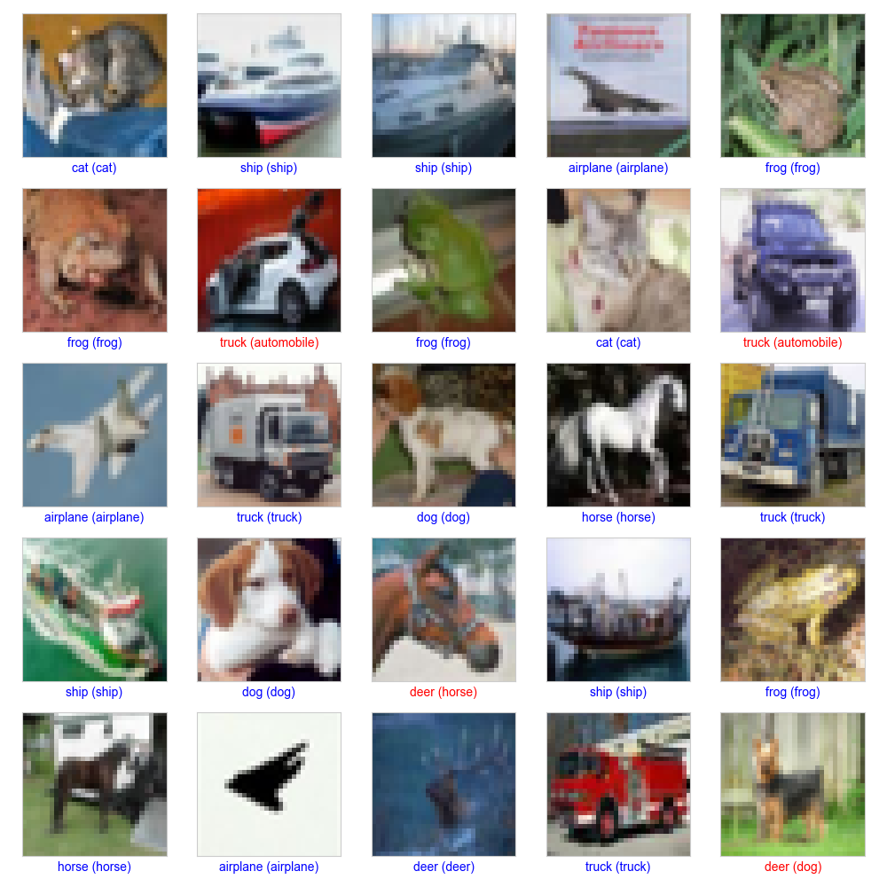

# 🖼️ Project 12: CIFAR-10 Image Classification with a CNN

## 🎯 Objective
To enter the world of Deep Learning and Computer Vision by building a Convolutional Neural Network (CNN) from scratch to classify small color images from the CIFAR-10 dataset into 10 categories.

## 📊 Dataset
- **Source:** Built-in `tensorflow.keras.datasets.cifar10`.
- **Description:** The CIFAR-10 dataset consists of 60,000 32x32 color images in 10 classes (e.g., airplane, car, bird, cat).

## 🛠️ Tech Stack
- Python
- TensorFlow & Keras
- NumPy
- Matplotlib

## 📈 Workflow
1.  **Data Loading & Preprocessing:** Loaded the CIFAR-10 dataset and normalized the pixel values to be between 0 and 1.
2.  **CNN Architecture:** Built a sequential Keras model consisting of multiple `Conv2D` and `MaxPooling2D` layers, followed by `Dense` layers for classification.
3.  **Model Training:** Compiled the model and trained it on the training dataset for 15 epochs.
4.  **Evaluation & Visualization:** Evaluated the model's accuracy on the test set and visualized its predictions on a sample of images.

## ✨ Key Results & Visuals
The custom-built CNN learned to successfully classify complex color images.
- **Accuracy:** Achieved **~70% accuracy** on the 10,000 unseen test images after 15 epochs of training.
- **Predictions:** The model demonstrated its ability to correctly identify various objects like ships, trucks, and frogs.

## 📚 Resources

  - **Video:** [3Blue1Brown: But what is a convolution?](https://www.youtube.com/watch?v=KuXjwB4LzSA)
  - **Documentation:** [TensorFlow: Convolutional Neural Network (CNN)](https://www.tensorflow.org/tutorials/images/cnn)
