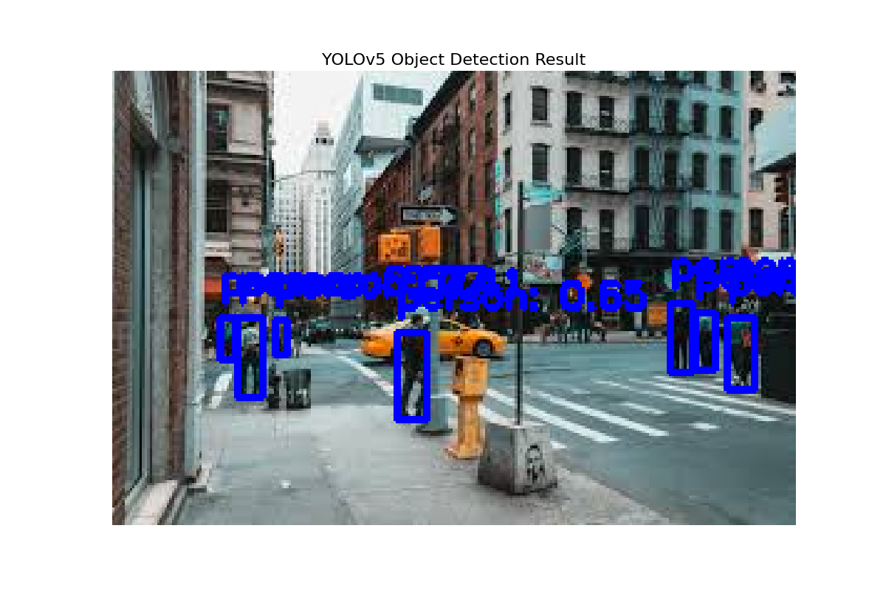

# 📸 Project 13: Object Detection with a Pre-trained YOLOv5 Model

## 🎯 Objective
To perform object detection by leveraging a powerful, pre-trained YOLOv5 model. This project focuses on Transfer Learning to identify and draw bounding boxes around multiple objects in a custom image.

## 📊 Dataset
- **Source:** This project does not require a training dataset. It uses the **YOLOv5 model pre-trained on the COCO dataset**.
- **Input:** Any custom `.jpg` image containing objects.

## 🛠️ Tech Stack
- Python
- PyTorch & TorchVision
- OpenCV-Python
- Matplotlib

## 📈 Workflow
1.  **Model Loading:** Loaded the pre-trained `yolov5s` model from PyTorch Hub.
2.  **Image Loading:** Loaded a custom image using OpenCV.
3.  **Inference:** Passed the image to the model to get a list of detections.
4.  **Visualization:** Looped through the detection results and used OpenCV to draw bounding boxes and labels for each object directly onto the image.

## ✨ Key Results & Visuals
The project demonstrates the power and efficiency of using pre-trained models for complex computer vision tasks.
- **Detections:** The YOLOv5 model successfully identified multiple objects (e.g., cars, people, traffic lights) in a sample image with high confidence scores, localizing each with a precise bounding box.

