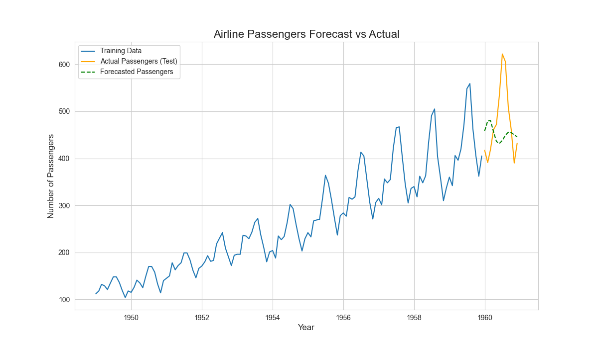

# ⏳ Project 14: Airline Passenger Forecasting with ARIMA

## 🎯 Objective
To build a time series forecasting model using the ARIMA method to predict future monthly airline passenger numbers based on historical data.

## 📊 Dataset
- **Source:** [Air Passengers Dataset on Kaggle](https://www.kaggle.com/datasets/rakannimer/air-passengers)
- **Description:** A dataset containing the total number of monthly international airline passengers from 1949 to 1960.

## 🛠️ Tech Stack
- Python
- Pandas
- Statsmodels
- Matplotlib

## 📈 Workflow
1.  **Data Loading & Preprocessing:** Loaded the data, parsed the 'Month' column into a datetime index.
2.  **Time Series Decomposition:** Decomposed the series into its trend, seasonal, and residual components to understand its structure.
3.  **Model Training:** Split the data chronologically and trained an ARIMA (AutoRegressive Integrated Moving Average) model on the training set.
4.  **Forecasting & Visualization:** Used the trained model to forecast passenger numbers for the test period and plotted the forecast against the actual values.

## ✨ Key Results & Visuals
The ARIMA model successfully captured the underlying patterns in the time series data.
- **Forecast:** The model's forecast closely followed the actual data, accurately predicting both the long-term upward trend and the yearly seasonal peaks in passenger traffic.

## 📚 Resources
- **Video:** [StatQuest: ARIMA Models, Clearly Explained](https://www.youtube.com/watch?v=g_S_N8v_g3Y)
- **Documentation:** [Statsmodels ARIMA Documentation](https://www.statsmodels.org/stable/generated/statsmodels.tsa.arima.model.ARIMA.html)
