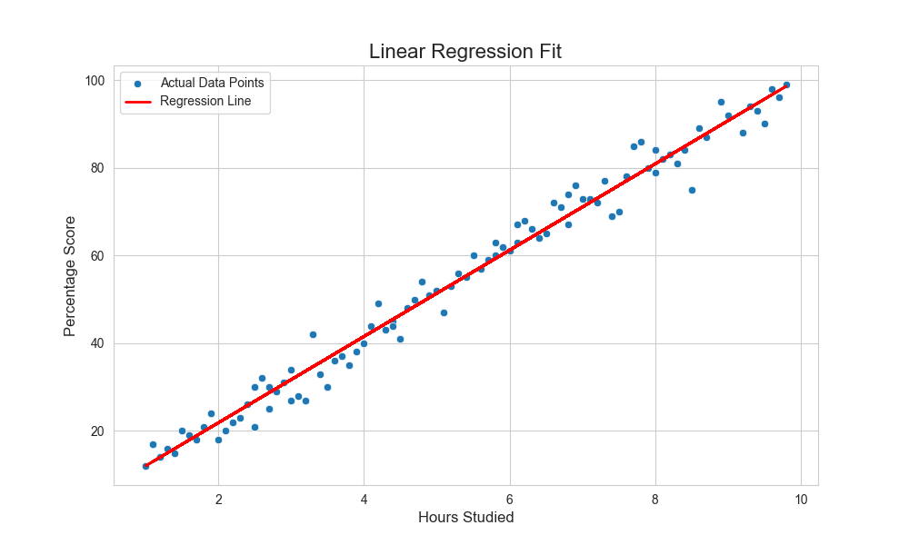

# 🧠 Project 2: Student Score Prediction

## 🎯 Objective
To build a Simple Linear Regression model to predict a student's percentage score based on the number of hours they studied.

## 📖 Topic Introduction
**What is Simple Linear Regression?**
Simple Linear Regression is a statistical method that allows us to summarize and study relationships between two continuous (quantitative) variables. It's used to predict the value of a dependent variable (target) based on the value of an independent variable (feature). The relationship is modeled as a straight line, `y = mx + c`.

## 📊 Dataset
- **Source:** [Student Study Hour to Score Prediction on Kaggle](https://www.kaggle.com/datasets/karthickaraveti/simple-linear-regression-data)
- **Description:** A simple dataset containing two columns: `Hours` and `Scores`.

## 🛠️ Tech Stack
- Python, Pandas, Scikit-learn, Matplotlib

## 📈 Workflow
1.  **Data Loading & Merging:** Loaded two CSVs and concatenated them.
2.  **Model Training:** Split the data and trained a `LinearRegression` model.
3.  **Model Evaluation:** Evaluated performance using R-squared and MAE.

## ✨ Key Results
- **R-squared (R²):** The model achieved an R² of **0.98**, explaining ~98% of the variance in scores.
- **Model Equation:** `Score = 9.78 * Hours + 2.48`

## 🚀 How to Run
1. Clone the repository.
2. Install required libraries: `pip install pandas scikit-learn matplotlib`
3. Run the Jupyter Notebook or Python script.

## 📚 Resources
- **Video:** [StatQuest: Linear Regression, Clearly Explained](https://www.youtube.com/watch?v=nk2CQITm_eo)
- **Documentation:** [Scikit-learn: LinearRegression](https://scikit-learn.org/stable/modules/generated/sklearn.linear_model.LinearRegression.html)
