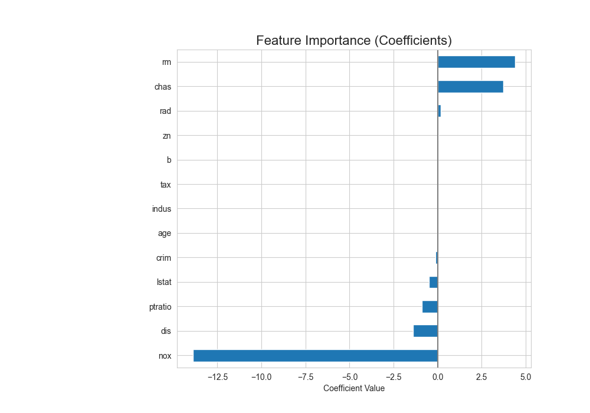

# 🏡 Project 3: Boston House Price Prediction

## 🎯 Objective
To build a Multiple Linear Regression model to predict the median value of homes in Boston suburbs based on various features.

## 📖 Topic Introduction
**What is Multiple Linear Regression?**
Multiple Linear Regression is an extension of Simple Linear Regression. It is used to predict the value of a dependent variable based on the value of **two or more** independent variables. The model fits a linear equation to the observed data and allows us to understand the contribution of each feature to the final prediction.

## 📊 Dataset
- **Source:** `HousingData.csv`, a version of the Boston Housing dataset.
- **Description:** Contains 14 features related to housing and demographics in Boston, with `MEDV` as the target.

## 🛠️ Tech Stack
- Python, Pandas, Scikit-learn, Matplotlib, Seaborn

## 📈 Workflow
1.  **Data Loading & Cleaning:** Loaded `HousingData.csv` and filled missing values.
2.  **EDA:** Created a correlation heatmap to understand feature relationships.
3.  **Model Training & Interpretation:** Trained a `LinearRegression` model and analyzed its coefficients to find the most important features.

## ✨ Key Results
- **R-squared (R²):** Achieved an R² of **0.71**, explaining ~71% of the price variation.
- **Key Features:** `RM` (number of rooms) was the strongest positive predictor, while `LSTAT` (% lower status) was the strongest negative predictor.

## 📚 Resources
- **Video:** [Krish Naik: Multiple Linear Regression](https://www.youtube.com/watch?v=J_L-s-iJ22k)
- **Article:** [Multiple Linear Regression - An Overview](https://www.investopedia.com/terms/m/mlr.asp)
