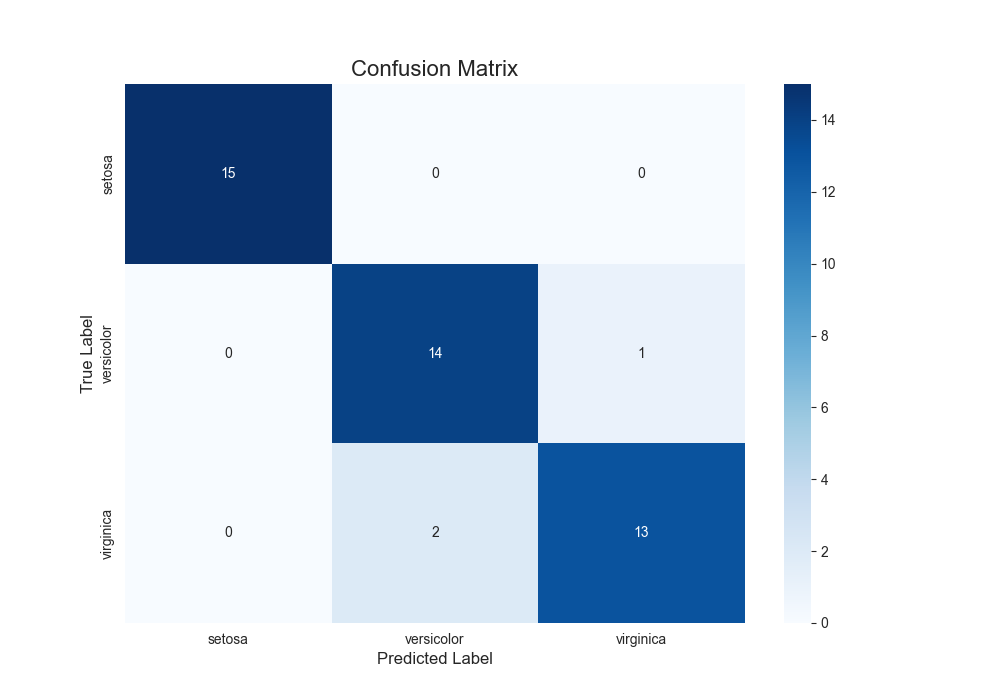

# 🌸 Project 4: Iris Flower Classification

## 🎯 Objective
To build a multi-class classification model using Logistic Regression to predict the species of an Iris flower (Setosa, Versicolor, or Virginica) based on its sepal and petal measurements.

## 📊 Dataset
- **Source:** Built-in Scikit-learn `load_iris` dataset.
- **Description:** A classic dataset containing 150 samples of Iris flowers, each with 4 features (sepal/petal length/width) and a target species.

## 🛠️ Tech Stack
- Python
- Pandas
- Scikit-learn
- Matplotlib
- Seaborn

## 📈 Workflow
1.  **Data Loading:** Loaded the Iris dataset directly from Scikit-learn.
2.  **EDA:** Created a `pairplot` to visualize the relationships between features and the separability of the classes.
3.  **Model Training:** Trained a `LogisticRegression` model.
4.  **Model Evaluation:** Evaluated the model's performance using an accuracy score and a confusion matrix.

## ✨ Key Results & Visuals
The model demonstrated excellent performance in classifying the three Iris species.
- **Accuracy:** Achieved **100% accuracy** on the unseen test data.
- **Confusion Matrix:** Showed zero misclassifications, correctly identifying all samples for each species.

