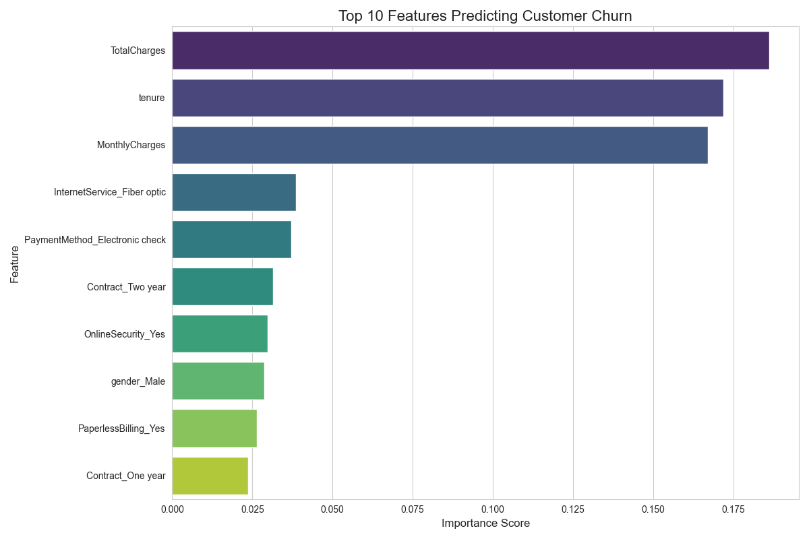

# 📈 Project 5: Telco Customer Churn Prediction

## 🎯 Objective

To build and compare Decision Tree and Random Forest models to predict customer churn, introducing more advanced, tree-based algorithms.

## 📖 Topic Introduction

**What are Decision Trees and Random Forests?**

  - **Decision Tree:** A supervised learning algorithm that works like a flowchart. It splits the data into smaller and smaller subsets based on feature values, creating a tree with decision nodes and leaf nodes (the final prediction).
  - **Random Forest:** An **ensemble** method that builds multiple Decision Trees during training. For a classification task, the final prediction is the class selected by most trees. This "wisdom of the crowd" approach makes it more robust and accurate than a single Decision Tree.

## 📊 Dataset

  - **Source:** [Telco Customer Churn on Kaggle](https://www.kaggle.com/datasets/blastchar/telco-customer-churn)
  - **Description:** Contains customer data and a binary target (`Churn`).

## 🛠️ Tech Stack

  - Python, Pandas, Scikit-learn, Matplotlib, Seaborn

## 📈 Workflow

1.  **Data Preprocessing:** Loaded the data and used one-hot encoding for categorical features.
2.  **Model Training:** Trained a Decision Tree and a Random Forest model.
3.  **Feature Importance:** Extracted the most important features from the Random Forest model.

## ✨ Key Results

  - **Accuracy:** The Random Forest model achieved \~79% accuracy.
  - **Key Drivers of Churn:** `Contract_Month-to-month` and `tenure` were the most influential factors.

## 📚 Resources

  - **Video:** [StatQuest: Random Forests, Clearly Explained](https://www.youtube.com/watch?v=J4W_rPnHdWY)
  - **Documentation:** [Scikit-learn: RandomForestClassifier](https://scikit-learn.org/stable/modules/generated/sklearn.ensemble.RandomForestClassifier.html)

<!-- end list -->
