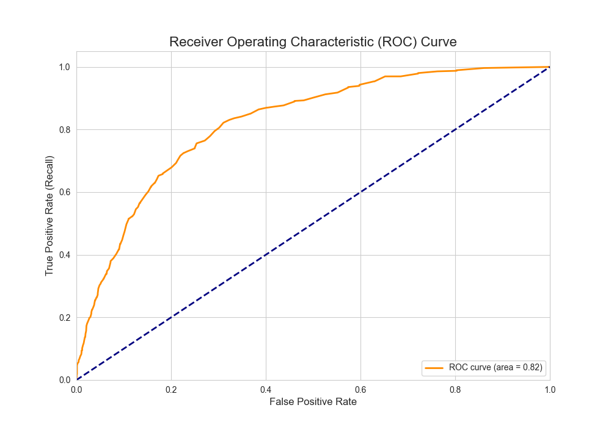

# 🎯 Project 6: Deeper Evaluation of Churn Model

## 🎯 Objective
To evaluate the churn model using metrics beyond accuracy, focusing on Precision, Recall, and the ROC/AUC curve, which are crucial for imbalanced datasets.

## 📖 Topic Introduction
**Why is Accuracy Not Enough?**
In datasets where one class is much more frequent than another (imbalanced data), accuracy can be misleading. A model can achieve high accuracy by simply predicting the majority class every time, but it will be useless.
- **Precision:** Answers the question: "Of all the predictions I made for a class, how many were correct?" (Minimizes false positives).
- **Recall:** Answers the question: "Of all the actual instances of a class, how many did I correctly predict?" (Minimizes false negatives).
- **ROC/AUC:** The ROC curve shows the trade-off between the true positive rate (Recall) and the false positive rate. The Area Under the Curve (AUC) summarizes this into a single number.

## 📊 Dataset
- **Source:** [Telco Customer Churn on Kaggle](https://www.kaggle.com/datasets/blastchar/telco-customer-churn)

## 🛠️ Tech Stack
- Python, Pandas, Scikit-learn, Matplotlib

## 📈 Workflow
1.  **Model Retraining:** Rebuilt the Random Forest model.
2.  **Advanced Metrics:** Generated a `classification_report` to analyze Precision and Recall.
3.  **ROC/AUC Analysis:** Plotted the ROC curve and calculated the AUC score.

## ✨ Key Results
- **Recall:** The model correctly identified ~51% of actual churners.
- **AUC Score:** Achieved an AUC score of **0.82**, indicating a good ability to distinguish between classes.

## 📚 Resources
- **Video:** [StatQuest: ROC and AUC, Clearly Explained!](https://www.youtube.com/watch?v=4jRBRDbJemM)
- **Documentation:** [Scikit-learn: Classification Metrics](https://scikit-learn.org/stable/modules/model_evaluation.html#classification-metrics)
