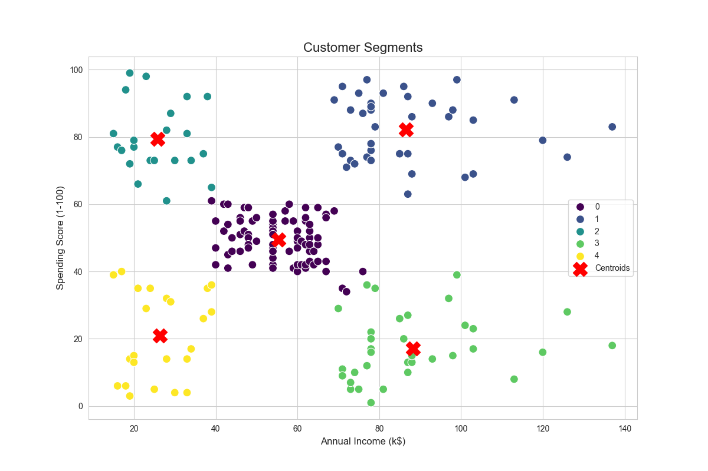

# 🛍️ Project 8: Customer Segmentation with K-Means

## 🎯 Objective
To use the K-Means clustering algorithm to segment mall customers into distinct groups based on their spending habits, introducing the concept of unsupervised learning.

## 📖 Topic Introduction
**What is Unsupervised Learning and K-Means?**
- **Unsupervised Learning:** A type of machine learning where the algorithm learns patterns from unlabeled data. There is no "correct answer" or target variable.
- **K-Means Clustering:** A popular unsupervised algorithm that aims to partition `n` observations into `k` clusters. It works by iteratively assigning each data point to the nearest cluster centroid and then recalculating the centroid's position. It's a simple yet powerful way to find natural groupings in data.

## 📊 Dataset
- **Source:** [Mall Customer Segmentation Data on Kaggle](https://www.kaggle.com/datasets/vjchoudhary7/customer-segmentation-tutorial-in-python)

## 🛠️ Tech Stack
- Python, Pandas, Scikit-learn, Matplotlib, Seaborn

## 📈 Workflow
1.  **Elbow Method:** Used this technique to find the optimal number of clusters (`k=5`).
2.  **Model Training:** Trained the final K-Means model with 5 clusters.
3.  **Visualization:** Created a scatter plot to visualize the final customer segments.

## ✨ Key Results
- **Customer Segments:** The model successfully identified 5 distinct customer personas, providing actionable insights for marketing strategies (e.g., "High Income, Low Spenders").

## 📚 Resources
- **Video:** [StatQuest: K-means clustering](https://www.youtube.com/watch?v=4b5d3muPQmA)
- **Documentation:** [Scikit-learn: KMeans](https://scikit-learn.org/stable/modules/generated/sklearn.cluster.KMeans.html)
