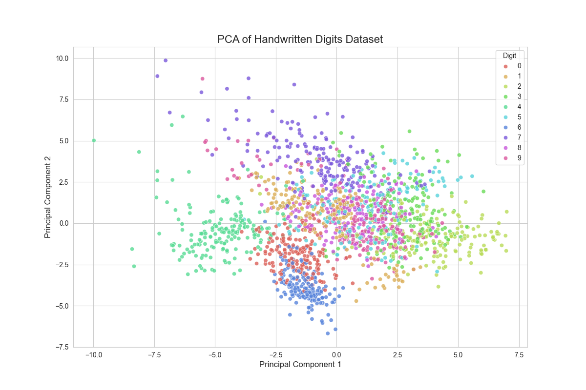

# 🎨 Project 9: Visualizing High-Dimensional Data with PCA

## 🎯 Objective
To use Principal Component Analysis (PCA) to compress a high-dimensional dataset of handwritten digits (64 features) down to just 2 dimensions for visualization.

## 📖 Topic Introduction
**What is Dimensionality Reduction and PCA?**
- **Dimensionality Reduction:** The process of reducing the number of features in a dataset. This is useful for visualizing high-dimensional data, reducing computational complexity, and mitigating the "curse of dimensionality."
- **Principal Component Analysis (PCA):** A popular unsupervised technique for dimensionality reduction. It transforms the data into a new set of uncorrelated variables called "principal components." These components are ordered so that the first few retain most of the variation present in the original data.

## 📊 Dataset
- **Source:** Built-in Scikit-learn `load_digits` dataset.
- **Description:** 8x8 pixel images of handwritten digits, flattened into 64-dimensional vectors.

## 🛠️ Tech Stack
- Python, NumPy, Scikit-learn, Matplotlib, Seaborn

## 📈 Workflow
1.  **Data Scaling:** Standardized all 64 features using `StandardScaler`.
2.  **Dimensionality Reduction:** Applied PCA to transform the 64-dimensional data into 2 principal components.
3.  **Visualization:** Created a 2D scatter plot of the two principal components.

## ✨ Key Results
- **Insight:** The resulting 2D plot shows that the different digits form distinct clusters, even after being compressed from 64 dimensions, demonstrating PCA's ability to preserve essential information.

## 📚 Resources
- **Video:** [StatQuest: Principal Component Analysis (PCA), Step-by-Step](https://www.youtube.com/watch?v=FgakZw6K1QQ)
- **Documentation:** [Scikit-learn: PCA](https://scikit-learn.org/stable/modules/generated/sklearn.decomposition.PCA.html)
